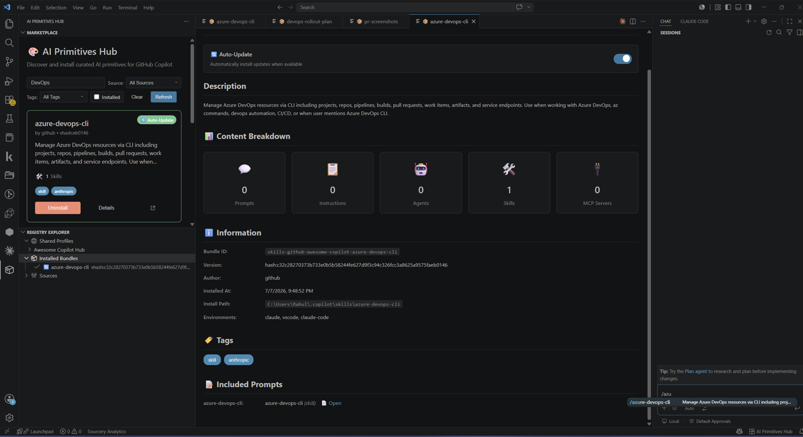
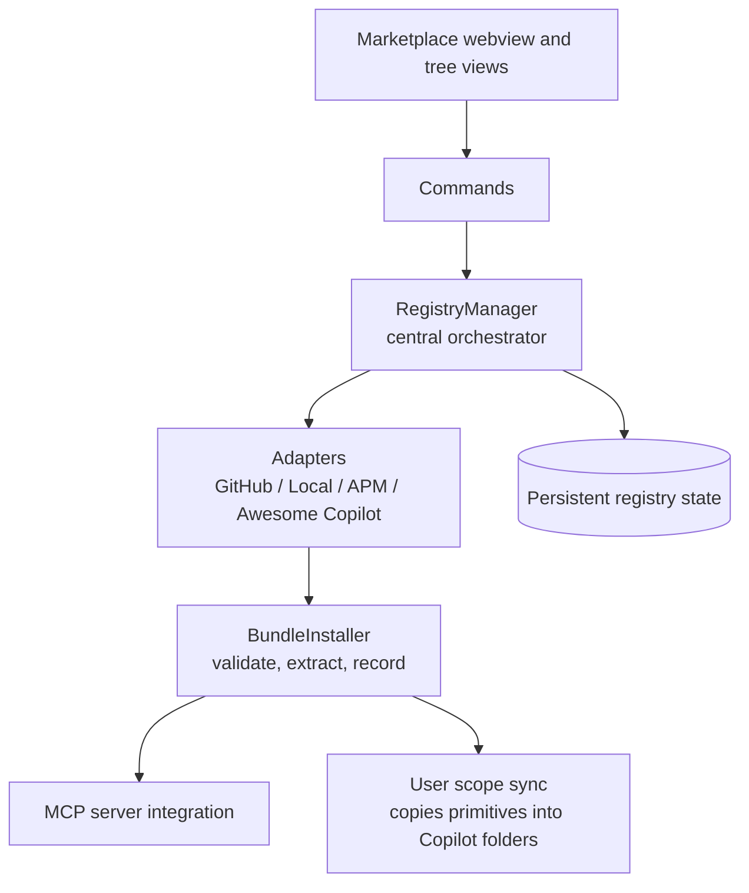

# 🎨 AI Primitives Hub

> A visual marketplace for discovering, installing, and managing GitHub Copilot prompt libraries from multiple sources.

[](https://marketplace.visualstudio.com/items?itemName=AmadeusITGroup.prompt-registry)
[](https://amadeusitgroup.github.io/ai-primitives-hub/)
[](https://opensource.org/licenses/Apache-2.0)
[](https://github.com/AmadeusITGroup/ai-primitives-hub/releases)

---

**AI Primitives Hub** transforms how you discover and manage GitHub Copilot prompts. Browse a visual marketplace, search by tags, and install curated prompt libraries with a single click—no manual file copying or repository cloning required.

> **ℹ️ Note:** This project was formerly known as **Prompt Registry**. It has been renamed to **AI Primitives Hub** to better reflect its broader scope. The extension ID (`AmadeusITGroup.prompt-registry`) and package name remain unchanged for compatibility — seeing `prompt-registry` in install commands and file names is expected.



---

## 📑 Table of Contents

- [Quick Start](#-quick-start)
- [Key Features](#-key-features)
- [Core Concepts](#-core-concepts)
- [Ask Copilot About AI Primitives Hub](#-ask-copilot-about-ai-primitives-hub)
- [Documentation](#-documentation)
- [Installation](#-installation)
- [Supported Sources](#-supported-sources)
- [Architecture Overview](#%EF%B8%8F-architecture-overview)
- [Repository Structure](#-repository-structure)
- [Troubleshooting](#-troubleshooting)
- [Contributing](#-contributing)
- [License](#-license)

---

## 🚀 Quick Start

1. **Install** — Search "AI Primitives Hub" in VS Code Extensions (`Ctrl+Shift+X`)
2. **Select Hub** — On first launch, choose a hub from the welcome dialog (or skip to configure later)
3. **Browse** — Click "MARKETPLACE" in the AI Primitives Hub sidebar
4. **Install** — Click any bundle tile, then click **Install**
5. **Use** — Open Copilot Chat and type `/` to see your installed prompts, or run the **"AI Primitives Hub: Sync All Bundles"** command to verify everything synced 🎉

The extension automatically adds the Awesome Copilot source and syncs your selected hub's profiles on startup.

→ [Full Getting Started Guide](./docs/user-guide/getting-started.md)

---

## ✨ Key Features

- **🎨 Visual Marketplace** — Browse bundles in a tile-based interface with search, filters, and one-click install ([details](./docs/user-guide/marketplace.md))
- **🔌 Multi-Source Support** — Connect to GitHub, local directories, APM repositories, or Awesome Copilot collections ([details](./docs/user-guide/sources.md))
- **📦 Version Management** — Track versions, detect updates, and enable automatic background updates ([details](./docs/user-guide/configuration.md))
- **👥 Profiles & Hubs** — Organize bundles by project/team and share configurations across your organization ([details](./docs/user-guide/profiles-and-hubs.md))
- **🤖 Built-in Copilot Skill** — Ask GitHub Copilot questions about AI Primitives Hub directly in chat — setup, authoring, troubleshooting, and more
- **🌍 Cross-Platform** — Works on macOS, Linux, and Windows with all VS Code flavors

---

## 📖 Core Concepts

New to the project? These six terms appear everywhere:

| Term | Meaning |
|------|---------|
| **Primitive** | A single AI asset: a prompt, instruction, agent, chat mode, skill, or MCP server configuration |
| **Bundle** | An installable package of primitives, described by a `deployment-manifest.yml` |
| **Collection** | A repository that offers one or more bundles |
| **Source** | Anywhere bundles come from — a GitHub repo, a local directory, an APM repository, or Awesome Copilot |
| **Hub** | A shared configuration that defines profiles for a team or organization |
| **Profile** | A named set of bundles within a hub (e.g. "frontend team") |

Every bundle ships a manifest that declares its contents. A minimal example:

```yaml
# deployment-manifest.yml
name: my-team-prompts
version: 1.0.0
description: Shared prompts for the frontend team
primitives:
  - type: prompt
    path: prompts/write-unit-tests.prompt.md
  - type: instruction
    path: instructions/typescript-style.instructions.md
```

Manifests are validated against the JSON schemas in [`schemas/`](./schemas/) at install time.

→ [Author Guide: Creating a Collection](./docs/author-guide/creating-source-bundle.md)

---

## 🤖 Ask Copilot About AI Primitives Hub

AI Primitives Hub ships with a built-in **Copilot skill** that lets you ask GitHub Copilot questions about the extension directly in chat. No extra setup is required — the skill is available as soon as the extension is installed.

**What you can ask:**
- **Users** — "How do I add a local source?", "What scopes are available?", "Why isn't my hub showing?"
- **Authors** — "How do I create a collection?", "What fields are required in a manifest?", "How do I publish to a hub?"

The skill answers from the extension's own documentation, so responses are always grounded in the actual behavior of your installed version.

> **Note:** The skill covers user and author topics only. For contributor questions (architecture, testing, internals), consult the [Contributor Guide](./docs/contributor-guide/development-setup.md) directly.

> **Seeing incorrect or unexpected answers?** Please [open an issue](https://github.com/AmadeusITGroup/ai-primitives-hub/issues) describing the question you asked and the response you received, or reach out to one of the project contributors directly.

---

## 📚 Documentation

| Audience | Description | Link |
|----------|-------------|------|
| **Users** | Installation, marketplace, sources, profiles, troubleshooting | [User Guide](./docs/user-guide/getting-started.md) |
| **Authors** | Creating, validating, and publishing prompt collections | [Author Guide](./docs/author-guide/creating-source-bundle.md) |
| **Contributors** | Development setup, architecture, testing, coding standards | [Contributor Guide](./docs/contributor-guide/development-setup.md) |
| **Reference** | Commands, settings, adapter API, hub schema | [Reference Docs](./docs/reference/commands.md) |

→ [Full Documentation Index](./docs/README.md)

---

## 📦 Installation


**From VS Code Marketplace:**
1. Open VS Code → Press `Ctrl+Shift+X`
2. Search "AI Primitives Hub" → Click **Install**

**From VSIX:**

Download the latest `.vsix` from the [Releases page](https://github.com/AmadeusITGroup/ai-primitives-hub/releases), then install it (replace `<version>` with the version you downloaded):

```bash
code --install-extension prompt-registry-<version>.vsix
```

**From Source:**
```bash
git clone https://github.com/AmadeusITGroup/ai-primitives-hub.git
cd ai-primitives-hub
npm install
npm run package:vsix
# Install the VSIX produced by the previous step (the filename includes the current version)
code --install-extension prompt-registry-<version>.vsix
```

**For custom VS Code instances** (with custom user-data-dir/extensions-dir):
```bash
# After building the VSIX above, install to your custom VS Code instance
code --user-data-dir "$ud" --extensions-dir "$ed" --install-extension prompt-registry-<version>.vsix
```

---

## 🔌 Supported Sources

| Source Type | Description
|-------------|-------------|
| **Awesome Copilot** | Curated community collections
| **GitHub** | Direct from GitHub repositories
| **Local** | File system directories 
| **APM** | APM package repositories

→ [Source Configuration Guide](./docs/user-guide/sources.md)

---

## 🏗️ Architecture Overview

The extension is layered: UI → Commands → Services → Adapters → Storage, with the **RegistryManager** orchestrating everything. All source types are accessed through a common **adapter** interface, so the rest of the codebase never contains source-specific logic.



**Install flow:** the adapter fetches the bundle → its `deployment-manifest.yml` is validated against the [JSON schemas](./schemas/) → contents are extracted to managed storage → primitives are synced into the folders GitHub Copilot reads → the update service tracks the bundle for new versions.

→ [Full Architecture Documentation](./docs/contributor-guide/architecture.md)

---

## 📁 Repository Structure

| Path | What lives there |
|------|------------------|
| [`src/`](./src/) | The VS Code extension: activation, commands, services, adapters, webview UI |
| [`lib/`](./lib/) | Core library and CLI — install bundles from the terminal without VS Code |
| [`schemas/`](./schemas/) | JSON schemas for collection and bundle manifests |
| [`github-actions/`](./github-actions/) | Reusable GitHub Action for validating collections in CI |
| [`docs/`](./docs/) | User, author, and contributor documentation |
| [`website/`](./website/) | Documentation website |
| [`templates/`](./templates/) | Scaffolding templates for new collections |
| [`test/`](./test/) | Unit and integration tests |

---

## 🔧 Troubleshooting

**Bundles not showing in Copilot?**
- Check sync completed in extension logs
- Run "AI Primitives Hub: Sync All Bundles"
- Reload VS Code (Command Palette → **"Developer: Reload Window"**)
- Verify the synced files exist on disk:


| OS | Synced prompts location |
|----|------------------------|
| Linux | `~/.config/Code/User/prompts` |
| macOS | `~/Library/Application Support/Code/User/prompts` |
| Windows | `%APPDATA%\Code\User\prompts` |

**Installation fails?**
- Verify network connection and repository access
- Check bundle has valid `deployment-manifest.yml` (validated against [`schemas/`](./schemas/))

→ [Full Troubleshooting Guide](./docs/user-guide/troubleshooting.md)

---

## 🤝 Contributing

We welcome contributions! See [CONTRIBUTING.md](./CONTRIBUTING.md) for guidelines.

→ [Development Setup](./docs/contributor-guide/development-setup.md) | [Coding Standards](./docs/contributor-guide/coding-standards.md)

---

## 📄 License

[Apache 2.0](./LICENSE.txt) — See [SECURITY.md](./SECURITY.md) for security policy.

---

## 🙏 Acknowledgments

- **Microsoft** - For GitHub Copilot and VS Code
- **Awesome Copilot Community** - For curated prompt collections
- **Contributors** - Everyone who has contributed to this project

---

## 🔗 Links

- [VS Code Marketplace](https://marketplace.visualstudio.com/items?itemName=AmadeusITGroup.prompt-registry)
- [GitHub Repository](https://github.com/AmadeusITGroup/ai-primitives-hub)
- [Report Issues](https://github.com/AmadeusITGroup/ai-primitives-hub/issues)
- [Discussions](https://github.com/AmadeusITGroup/ai-primitives-hub/discussions)
- [Releases](https://github.com/AmadeusITGroup/ai-primitives-hub/releases)