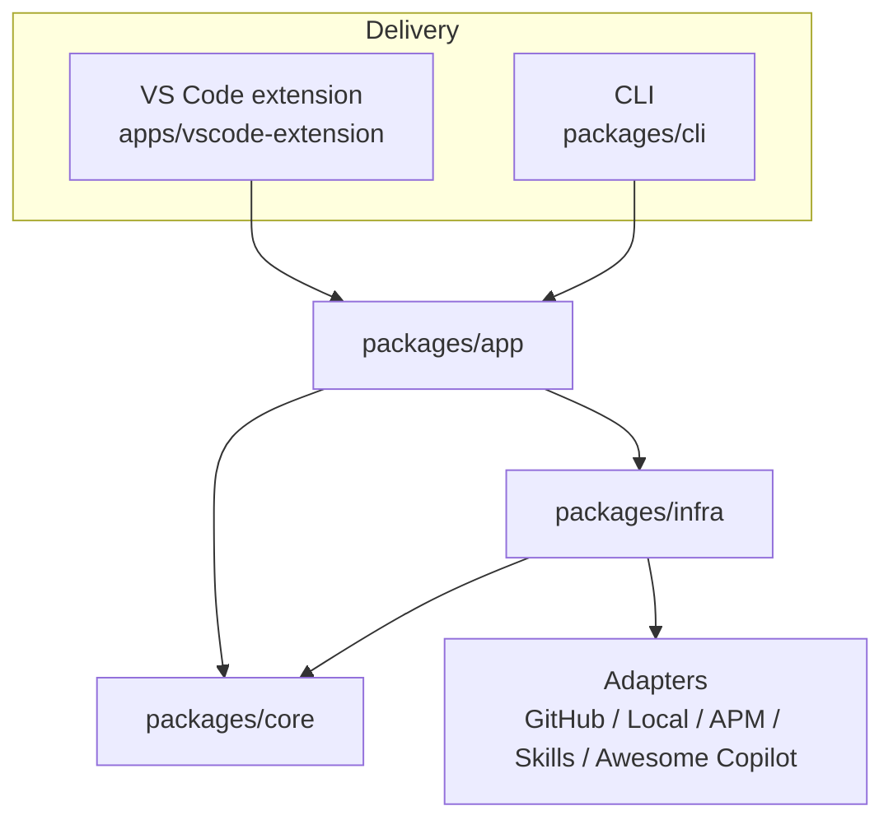

# 🎨 AI Primitives Hub

> A monorepo for the AI Primitives Hub: a VS Code marketplace and a shared set of ports-and-adapters packages for discovering, installing, and managing GitHub Copilot prompt libraries.

[](https://marketplace.visualstudio.com/items?itemName=AmadeusITGroup.prompt-registry)
[](https://amadeusitgroup.github.io/ai-primitives-hub/)
[](https://opensource.org/licenses/Apache-2.0)
[](https://github.com/AmadeusITGroup/ai-primitives-hub/releases)

**AI Primitives Hub** lets users discover and manage GitHub Copilot prompts through a VS Code extension, while providing reusable domain libraries, adapters, and a CLI for building, installing, and transforming prompt collections across multiple targets.

> **ℹ️ Note:** This project was formerly known as **Prompt Registry**. The VS Code extension ID (`AmadeusITGroup.prompt-registry`) and lockfile names remain unchanged for compatibility — seeing `prompt-registry` in paths is expected.

## 📑 Table of Contents

- [Quick Start](#-quick-start)
- [Repository Structure](#-repository-structure)
- [Architecture](#%EF%B8%8F-architecture)
- [Documentation](#-documentation)
- [Contributing](#-contributing)
- [License](#-license)

## 🚀 Quick Start

**As a VS Code user:**
Search "AI Primitives Hub" in the Extensions panel, or build from source using [`apps/vscode-extension/README.md`](./apps/vscode-extension/README.md).

**As a collection author:**
See the [Author Guide](./docs/author-guide/creating-source-bundle.md).

**As a contributor:**

```bash
git clone https://github.com/AmadeusITGroup/ai-primitives-hub.git
cd ai-primitives-hub
pnpm install
pnpm build        # build all workspace packages
pnpm test         # run all workspace tests
pnpm lint
```

## 📁 Repository Structure

| Path | Purpose |
|------|---------|
| `apps/vscode-extension/` | VS Code extension: UI, commands, services, adapters |
| `packages/core/` | Domain types and port interfaces |
| `packages/infra/` | Adapter implementations: sources, stores, writers, scaffolding |
| `packages/app/` | Use-case orchestration: install, registry, discovery, transforms |
| `packages/cli/` | Terminal interface calling `app` |
| `lib/` | Legacy collection scripts (deprecated in place) |
| `github-actions/validate-collections/` | Reusable GitHub Action for validating collections in CI |
| `docs/` | User, author, and contributor documentation |
| `website/` | Docusaurus documentation site |
| `config/` | Default hubs configuration |

## 🏗️ Architecture

The monorepo is organized around a shared `core` domain, with `infra` adapters, an `app` orchestration layer, and thin delivery layers for the VS Code extension and the CLI.



For extension details, see the [Contributor Architecture Guide](./docs/contributor-guide/architecture.md).

## 📚 Documentation

- [User Guide](./docs/user-guide/getting-started.md)
- [Author Guide](./docs/author-guide/creating-source-bundle.md)
- [Contributor Guide](./docs/contributor-guide/development-setup.md)
- [Architecture](./docs/contributor-guide/architecture.md)
- [Reference](./docs/reference/commands.md)

See the full index: [`docs/README.md`](./docs/README.md).

## 🤝 Contributing

See [CONTRIBUTING.md](./CONTRIBUTING.md) and [CODE_OF_CONDUCT.md](./CODE_OF_CONDUCT.md). For security, see [SECURITY.md](./SECURITY.md).

## 📄 License

[Apache 2.0](./apps/vscode-extension/LICENSE.txt)
