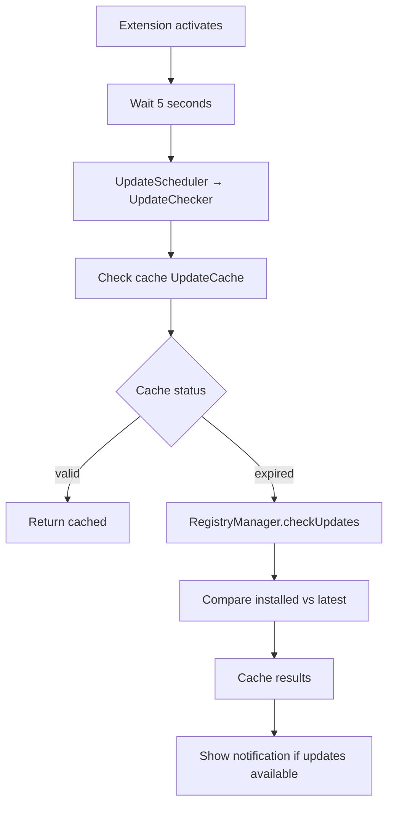

# Update System

Automatic detection and installation of bundle updates.

## Components

| Component | Responsibility |
|-----------|---------------|
| **UpdateScheduler** | Timing of checks (startup, daily/weekly) |
| **UpdateChecker** | Compare installed vs latest versions |
| **AutoUpdateService** | Background updates with rollback |
| **UpdateCache** | Cache results with configurable TTL |

## Configuration

| Setting | Default | Description |
|---------|---------|-------------|
| `promptregistry.updateCheck.enabled` | `true` | Enable update checks |
| `promptregistry.updateCheck.frequency` | `daily` | `daily`, `weekly`, `manual` |
| `promptregistry.updateCheck.autoUpdate` | `false` | Global gate for auto-updates |
| `promptregistry.updateCheck.cacheTTL` | `300000` | Cache TTL (5 min) |
| `promptregistry.updateCheck.notificationPreference` | `all` | `all`, `major`, `none` |

## Update Check Flow



## Auto-Update Logic

**Hybrid approach**: Global `autoUpdate` setting + per-bundle opt-in

For auto-update to occur:
1. Global `updateCheck.autoUpdate` = `true`
2. Per-bundle auto-update enabled (via "Enable Auto-Update" command)

## Concurrency Control

- **Batch Size**: 3 concurrent updates
- **Active Updates Set**: Prevents duplicate operations
- **Check-in-Progress Flag**: Prevents overlapping cycles

## Dependency Injection

Uses interfaces to avoid circular dependencies:

```typescript
interface BundleOperations {
    updateBundle(bundleId: string, version?: string): Promise<void>;
    listInstalledBundles(): Promise<InstalledBundle[]>;
}

class AutoUpdateService {
    constructor(
        private readonly bundleOps: BundleOperations,
        private readonly sourceOps: SourceOperations
    ) {}
}
```

## Hub Sync Scheduler

Separate from bundle update checks, `HubSyncScheduler` keeps the active hub configuration fresh:

| Component | Responsibility |
|-----------|---------------|
| **HubSyncScheduler** | 24h periodic timer calling `HubManager.syncActiveHub()` |
| **HubManager.onHubSynced** | Event fired after every hub sync (startup, manual, periodic) |

Source sync is event-driven: a single `onHubSynced` listener in `extension.ts` triggers `syncAllSources({ silent: true })` after any hub sync, ensuring sources stay in sync regardless of how the hub sync was initiated.

### Source Registration and Pruning

`loadHubSources` (in `packages/app`) reconciles a hub config's `sources[]` declarations with the registry on every sync. A stored source's id is derived from its location — `generateSourceId(type, url, { branch, collectionsPath })` — so the same URL declared by two hubs resolves to one stored source, and changing a declaration's `url` produces a *different* stored id.

Each sync tracks two distinct sets:

| Set | Contents | Purpose |
|---|---|---|
| Protected from pruning | Every declared source id, including disabled declarations and matched duplicates | Sources in this set are never removed |
| Registered this cycle | Only ids a successful `addSource` or `updateSource` wrote during this sync | The only pool eligible as a remap target |

A stored source belonging to the synced hub whose id is not protected is an **orphan** — typically the pre-rename record left behind by a `url` change.

### Matching an Orphan to Its Replacement

Each stored hub source carries `hubSourceId`, the author-assigned `sources[].id` from the hub config. That value is stable across a `url` change, so it is the matching key rather than the URL-derived id.

An orphan's replacement candidates are the sources registered this cycle whose `(hubId, hubSourceId)` pair equals the orphan's. Since `hubSourceId` is unique within a hub by schema, the pair is unique across hubs.

- **Exactly one candidate** — `remapBundleSource` moves installed-bundle references (repository-scope lockfile, plus user and workspace scope) from the orphan id to the candidate id, then the orphan is removed. The remap resolves the replacement descriptor *before* any write, so a missing replacement fails without mutating anything.
- **Anything else** — keep-alive.

Requiring exactly one candidate is what makes selection deterministic: a one-element result is independent of the order concurrent workers populated the map in, so `concurrency: 4` and `concurrency: 1` pick the same id.

### Keep-Alive

Keep-alive leaves the orphan in storage, leaves its installed-bundle records untouched, and emits one `warn` naming the orphan id and name, the number of referencing installed bundles, the reason, and the remediation. It applies when:

- zero candidates match,
- two or more candidates match,
- the orphan carries no `hubSourceId`,
- the remap failed,
- or the `remapBundleSource` port is not wired.

A guessed remap silently detaches bundles from their real origin and is unrecoverable; a kept orphan is inert and resolvable on the next sync. Two further guards: an orphan with zero referencing installed bundles is removed outright without a remap, and if any `addSource` failed during the sync, all orphan evaluation, removal, and remapping is skipped for that cycle.

### Sticker Backfill

`hubSourceId` is optional, so sources persisted before the field existed have none, and orphan handling for them falls back to keep-alive. Every successful sync writes `hubSourceId` on both added and updated sources, so the next successful sync of the owning hub backfills the field and restores deterministic matching.

## See Also

- [Installation Flow](./installation-flow.md) — How updates are installed
- [User Guide: Marketplace](../../user-guide/marketplace.md) — User-facing updates
- [User Guide: Profiles and Hubs](../../user-guide/profiles-and-hubs.md) — Hub sync behavior
